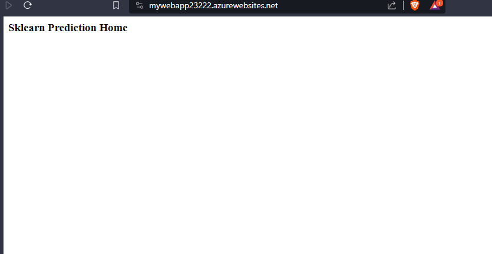
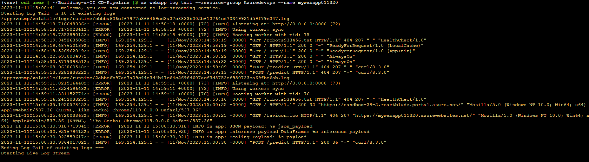
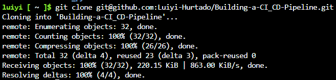
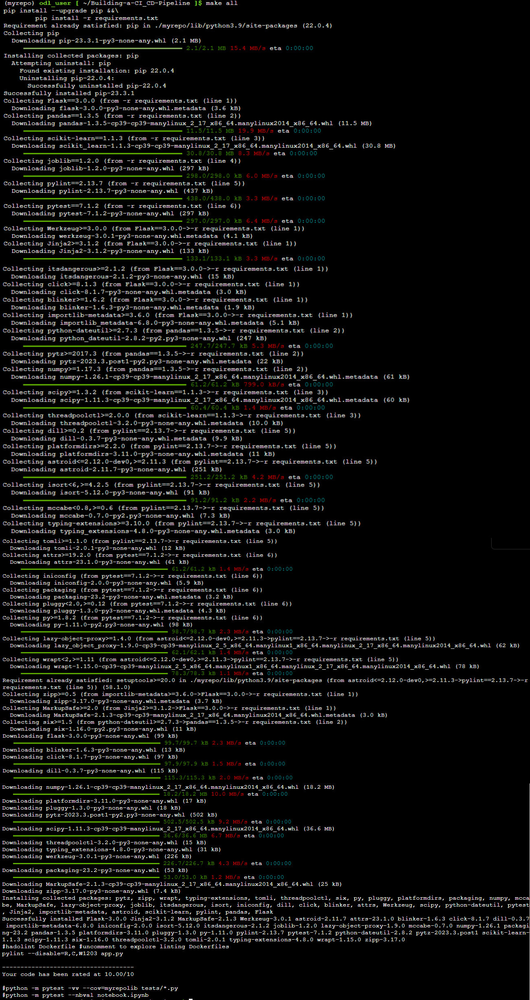
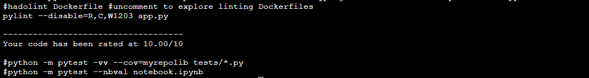
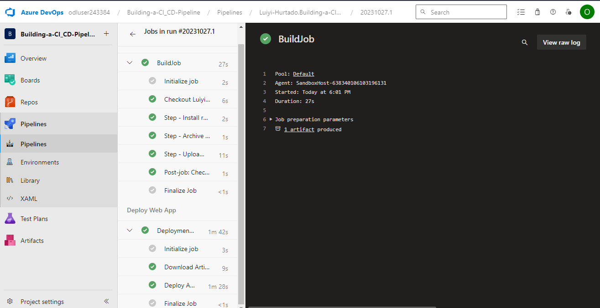
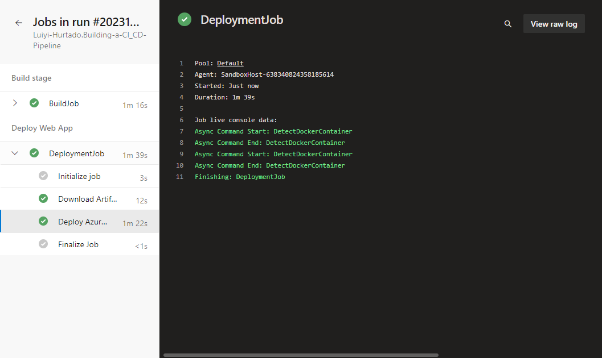
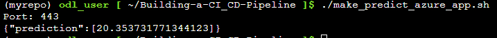
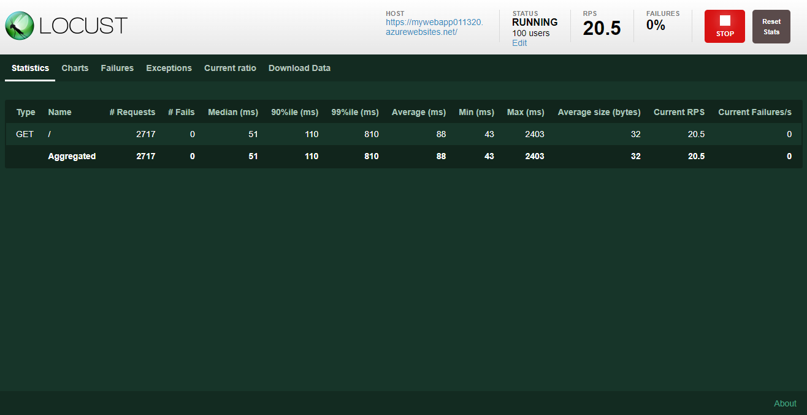
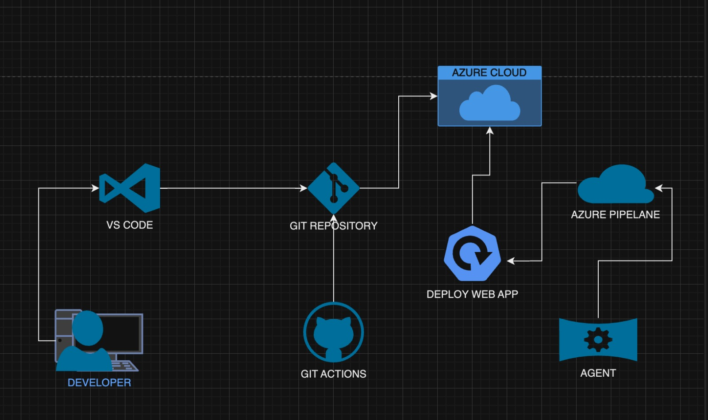

# Overview

This README provides a comprehensive guide on setting up a web application and creating an Azure Pipeline for streamlined deployment and continuous integration. This project is designed to help developers and DevOps engineers establish an efficient workflow for web application development and deployment using Azure DevOps services.

## Project Plan

* [Trello board for the project](https://trello.com/b/dyM9anQv/building-ci-cd-pipeline)
* Spreadsheet that includes:
  * The [original](https://docs.google.com/spreadsheets/d/16ja-pMVaXWIozAIDHGYrRSwYyVIbuzBHSg1zjiCkXZE/edit?usp=sharing) project plan
  * The [final](https://docs.google.com/spreadsheets/d/1tNBkEXDg3wKSsdqceFdp_zETSuWycQUvltIu6fD3_jE/edit?usp=sharing) project plan

## Instructions

### Project running on Azure App Service

* Deploy your web application to Azure App Service using Azure CLI, Azure DevOps, or any other deployment method of your choice.\




### Project cloned into Azure Cloud Shell

#### 1. Access Azure Cloud Shell

* Open the Azure Portal (<https://portal.azure.com>).
* Click on the Cloud Shell icon in the upper-right corner.

#### 2. Clone Project

* Create the clone


### Passing Tests After Running make all Command

#### 1. Navigate to Project Directory

* Change to the directory where your project is located:

```bash
cd <project_directory>
```

#### 2. Run Tests

* Execute the make all command to run tests and build the project.\


### Output of a test run

* The output of the test run will be displayed in your terminal, indicating whether the tests passed or failed. Review the output to ensure all tests pass.\


### Successful deploy of the project in Azure Pipelines

* Your deployment to Azure Pipelines should already be configured in your project. If not, follow the instructions in your project's documentation to set up the deployment pipeline.


### Running Azure App Service from Azure Pipelines automatic deployment

* After your deployment pipeline is set up, the Azure App Service will automatically run the latest version of your application when a successful build is completed.\


### Successful prediction from deployed flask app in Azure Cloud Shell

* After your deployment pipeline is set up, the Azure App Service will automatically run the latest version of your application when a successful build is completed.

* **make prediction**


* **Using the locust file**

>
## Enhancements

Please consider upgrading the versions of the projects to ensure you're using the latest enhancements and improvements. Additionally, we recommend upgrading your courses to stay up-to-date with the latest content and knowledge.

## Demo

[](https://youtu.be/9hJPGa2GdpE)

[](https://github.com/Luiyi-Hurtado/Building-a-CI_CD-Pipeline/actions/workflows/pythonapp.yml)
